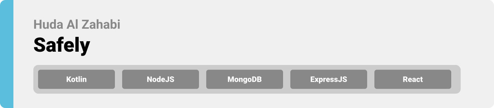

<div align="center">

> Hello world! This is the project’s summary that describes the project plain and simple, limited to the space available.

**[PROJECT PHILOSOPHY](https://github.com/huda-alzahabi/Safely#project-philosophy) • [WIREFRAMES](https://github.com/huda-alzahabi/Safely#wireframes) • [TECH STACK](https://github.com/huda-alzahabi/Safely#tech-stack) • [IMPLEMENTATION](https://github.com/huda-alzahabi/Safely#implementation) • [HOW TO RUN?](https://github.com/huda-alzahabi/Safely#how-to-run)**

</div>

<br><br>

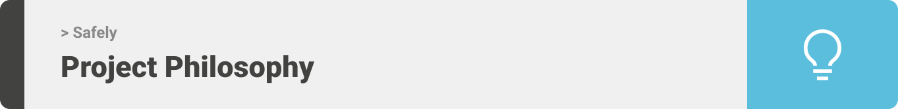

> Safely is a medical app built to facilitate patients' lives. Safely is more than just a random medical app; it is multi language, multi theme , and it stores your medical records and directs you to the nearest hospitals, wherever you are.

### User Stories

#### &nbsp; &nbsp; &nbsp; &nbsp; &nbsp; As a user:

- I want to change the language of my app so that I can use it freely.
- I want to change the theme to dark so that I use it comfortably at night.

#### &nbsp; &nbsp; &nbsp; &nbsp; &nbsp; As a patient:

- I want to store my medical records so that I can access them whenever I want.
- I want to use Google Maps to locate me so that I can find the nearest hospitals.
- I want to be able to see the doctors' professions and years of experience so that I can book appoitments with them.

#### &nbsp; &nbsp; &nbsp; &nbsp; &nbsp; As a doctor:

- I want to be able to choose the hospital I work at, so that the patients can find me.
- I want to add my available time slots for appointments, so that the patients can access them.
- I want to receive notification about scheduled appointments, so that I become aware of the patient name and appointment date.

#### &nbsp; &nbsp; &nbsp; &nbsp; &nbsp; As a hospital:

- I want to add my location, my address, and outpatient clinics working hours, so that patients can find me.

#### &nbsp; &nbsp; &nbsp; &nbsp; &nbsp; As an admin:

- I want to view statistics about the app, so that I can see how it is used.
- I want view all my users and their information, so that I can manage, delete and add users.

<br><br>


> This design was planned before on paper, then moved to Figma app for the fine details.
> Note that I didn't use any styling library or theme, all from scratch and using pure css and xml modules

| Welcome                                     | Login                                   | User Type                                      | Signup                                    |
| ------------------------------------------- | --------------------------------------- | ---------------------------------------------- | ----------------------------------------- |
|  | 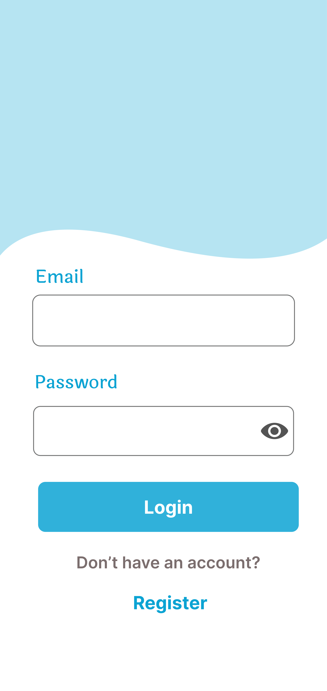 | 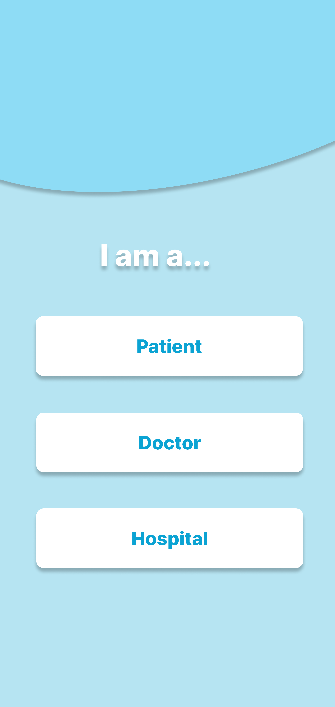 |  |

| Edit Profile                                     | Location                                      | Hospitals                                       | Doctors                                     |
| ------------------------------------------------ | --------------------------------------------- | ----------------------------------------------- | ------------------------------------------- |
| 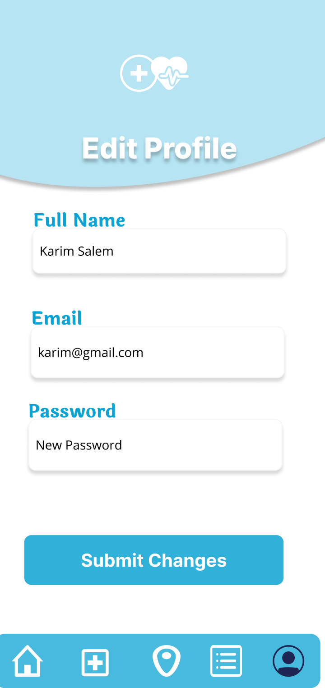 |  | 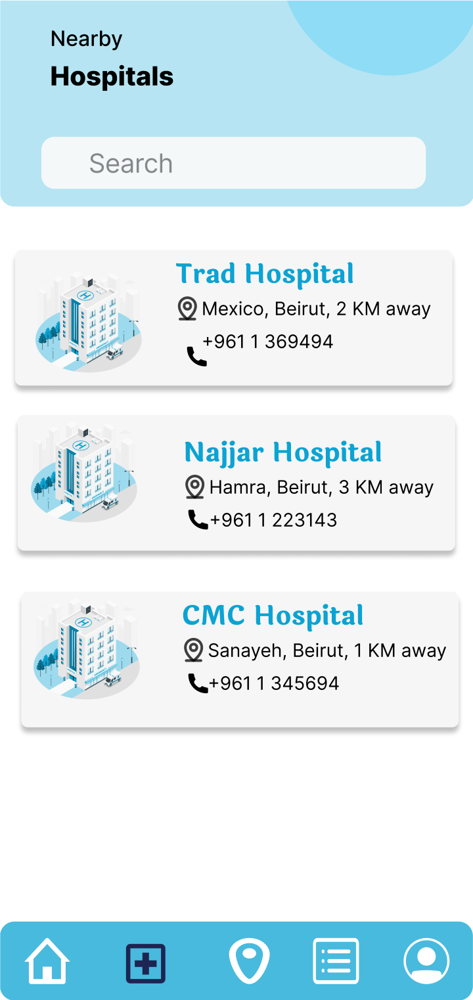 | 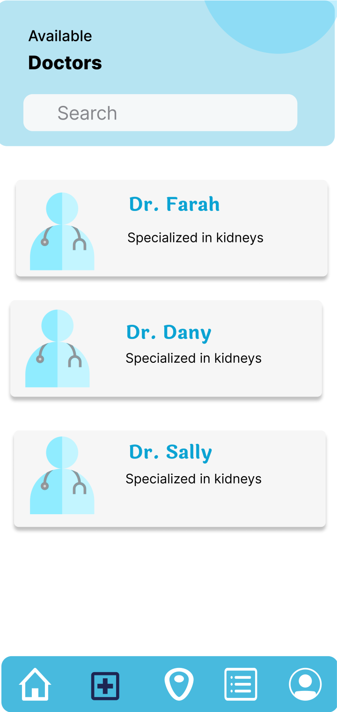 |

<br><br>

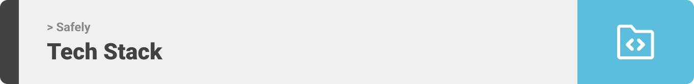

Here's a brief high-level overview of the tech stack Safely uses:

- This project uses the [Kotlin language](https://kotlinlang.org/docs/home.html). Kotlin is a cross-platform, statically typed, general-purpose programming language with type inference, announced by google as the preferred language for Android app developers.

- The admin panel uses [React](https://reactjs.org/). React is a JavaScript library for building user interfaces.

- For persistent storage (database), the app uses [MongoDB](https://www.mongodb.com/atlas/database) to store the data and [Node.js](https://nodejs.org/en/) as the run-time environment.

- To send push notifications, the app uses [firebase](https://firebase.google.com/docs) which supports Android, iOS, and macOS.

- The app uses the fonts [Inter](https://fonts.google.com/specimen/Inter) and [Laila](https://fonts.google.com/?query=Laila) as its main fonts, and the design of the app adheres to the material design guidelines.

<br><br>
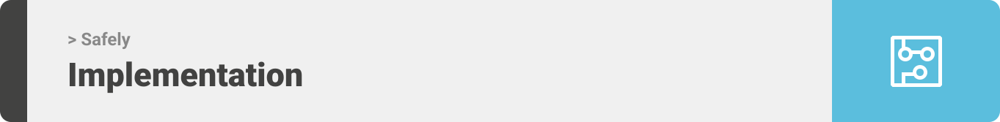

<div align="center">

> Using the above mentioned tech stacks and the wireframes built with figma from the user stories we have, the implementation of the app is shown as below, these are screenshots and gifs from the real app

| Welcome/Login                                    | Signup Failed                                    | Patient Info/ Location                                    |
| ------------------------------------------------ | ------------------------------------------------ | --------------------------------------------------------- |
| 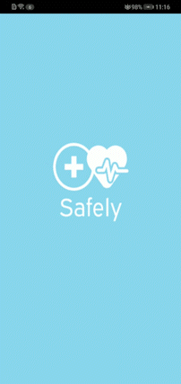 |  | 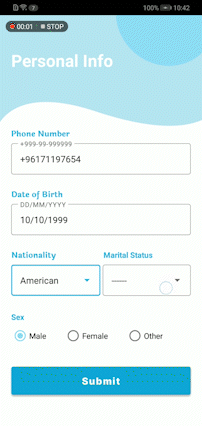 |

| Medical Records                                       | Patient Home/ Nearby Hospitals                               | Doctors/ Search                      |
| ----------------------------------------------------- | ------------------------------------------------------------ | ------------------------------------ |
| 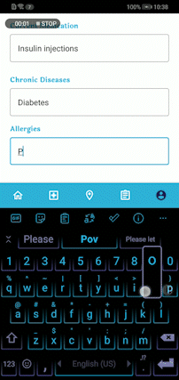 | 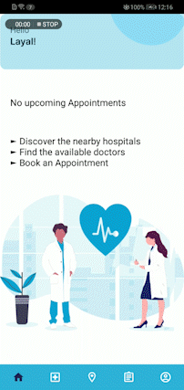 | 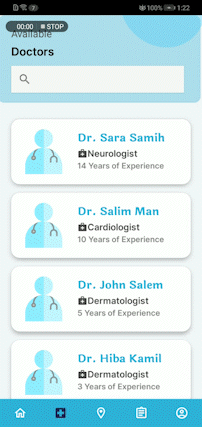 |

| Edit Profile                                    | Choose Day/ Time                                | Confirm Appointment                                           |
| ----------------------------------------------- | ----------------------------------------------- | ------------------------------------------------------------- |
| 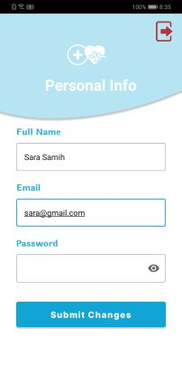 | 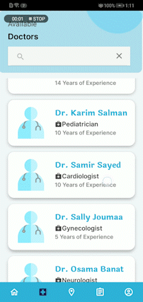 | 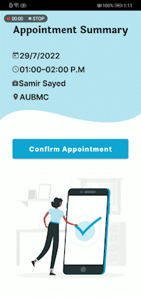 |

| Doctor Availability                                    | Doctor Appointments                                      | Hospital Home                                |
| ------------------------------------------------------ | -------------------------------------------------------- | -------------------------------------------- |
| 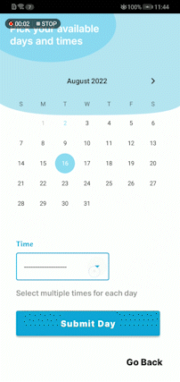 | 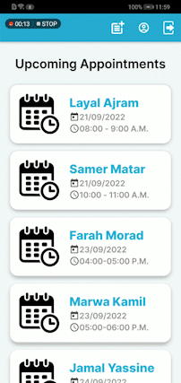 |  |

### Safely in French

| Welcome                                    | Patient Home                               | Doctor Info                                | Doctor Availability                        |
| ------------------------------------------ | ------------------------------------------ | ------------------------------------------ | ------------------------------------------ |
|  | 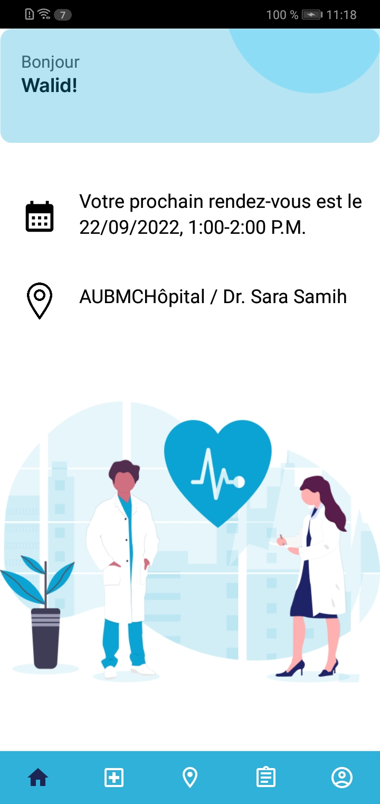 | 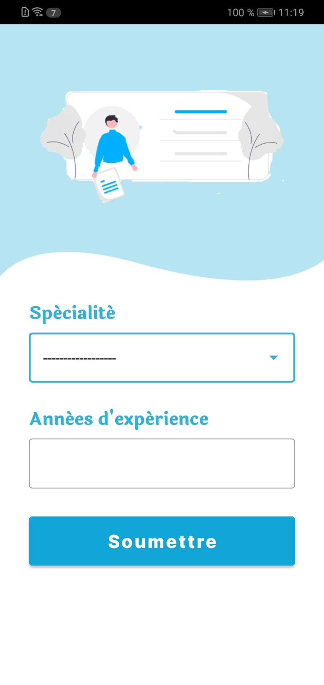 | 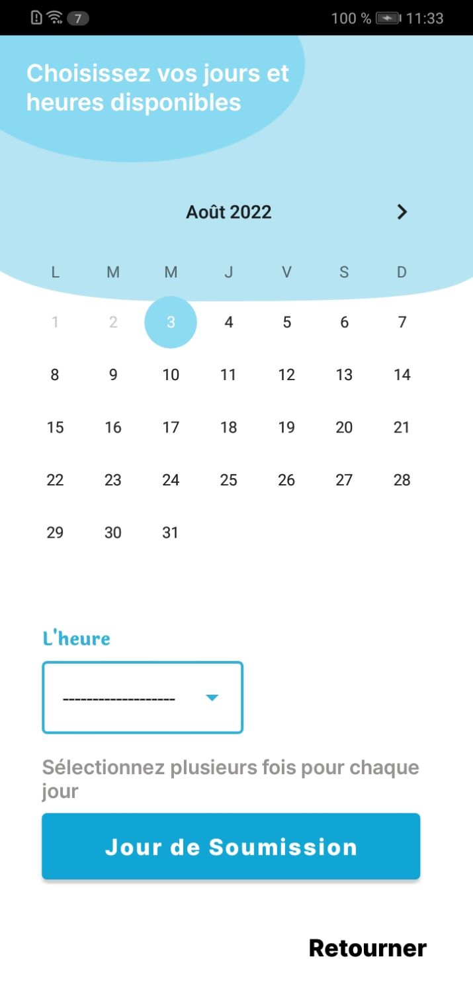 |

### Dark Mode

| Patient Home                             | Nearby Hospitals                              | Medical Records                             |
| ---------------------------------------- | --------------------------------------------- | ------------------------------------------- |
| 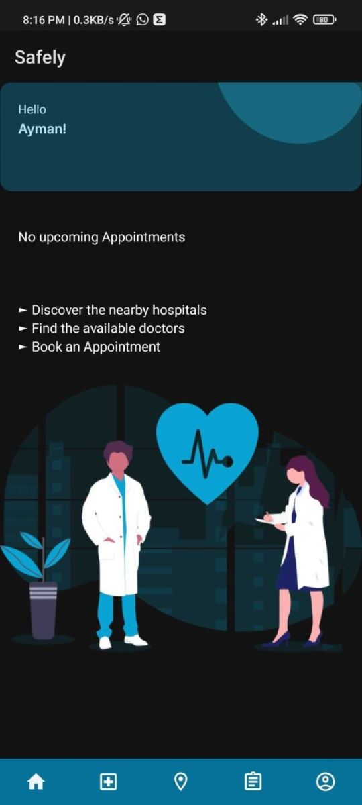 | 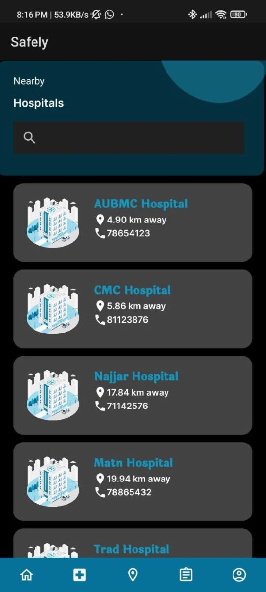 | 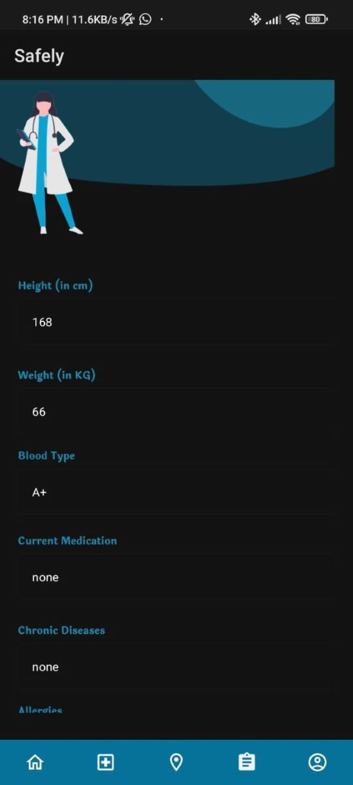 |

### Admin

| Login/ Unauthorized |
| ------------------- |
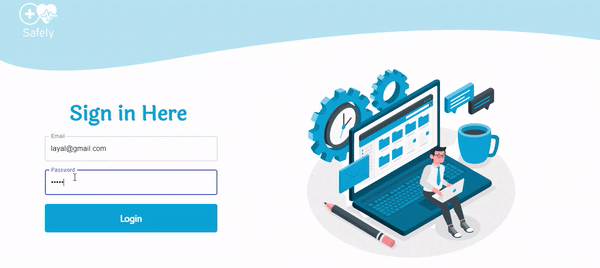

| Statistics |
| ---------- |
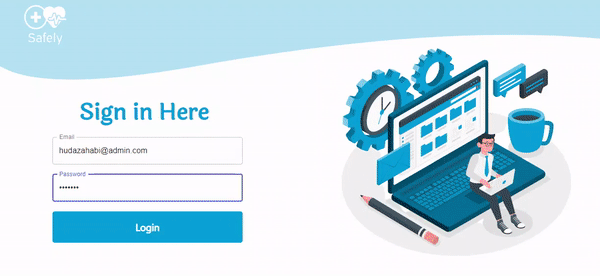

| View/ Search/ Delete Users |
| -------------------------- |
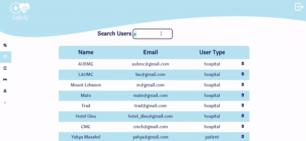

| Hospitals/ Patients/ Doctors |
| ---------------------------- |
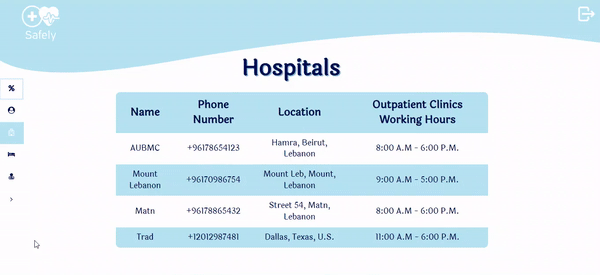

| Add User |
| -------- |
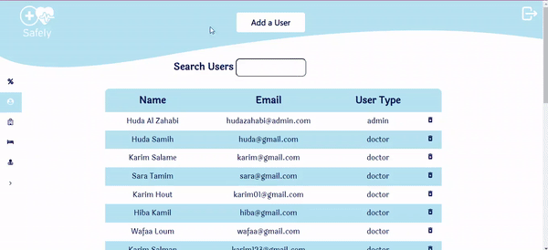

</div>
<br><br>


> To get a local copy up and running follow these simple steps.

### Prerequisites

- Download and Install [Node.js](https://nodejs.org/en/)
- Download and Install [Android Studio](https://developer.android.com/studio/index.html)
- Download an android emulator device or connect a real android device to your computer.
- npm
  ```sh
  npm install npm@latest -g
  ```

### Installation

1. Get a free Google Maps API Key at [Google Maps Platform](https://developers.google.com/maps)
2. Clone the repo
   ```sh
   git clone https://github.com/huda-alzahabi/Safely.git
   ```

### Running the app

1. Navigate to the backend folder and run the following command
   ```sh
   cd safely-backend
   npm start
   ```
2. Navigate to the Frontend folder: safely-frontend, open it in Android Studio and run the app.

3. Enter your Google Maps API in `local.properties` in the frontend folder
   ```js
   MAPS_API_KEY = "ENTER YOUR API";
   ```
