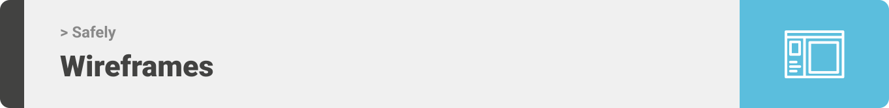

<div align="center">

> Hello world! This is the project’s summary that describes the project plain and simple, limited to the space available. 
 


**[PROJECT PHILOSOPHY](https://github.com/huda-alzahabi/Safely#project-philosophy) • [WIREFRAMES](https://github.com/huda-alzahabi/Safely#wireframes) • [TECH STACK](https://github.com/huda-alzahabi/Safely#tech-stack) • [IMPLEMENTATION](https://github.com/huda-alzahabi/Safely#implementation) • [HOW TO RUN?](https://github.com/huda-alzahabi/Safely#how-to-run)**

</div>

<br><br>


> Safely is a medical app built to facilitate patients' lives. Safely is more than just a random medical app; it stores your medical records and directs you to the nearest hospitals to your location, wherever you are.

### User Stories

#### &nbsp; &nbsp; &nbsp; &nbsp; &nbsp;  As a patient: 

- I want to store my medical records so I can access them whenever I want.
- I want to find the nearest hospital to me so I can get the best service.
- I want to know the distance between me and the nearby hospitals in KM.
- I want to be able to see the doctors' professions and years of experience so I can book appoitments with them.
- I want to travel without worrying about my medications and treatment.

#### &nbsp; &nbsp; &nbsp; &nbsp; &nbsp;  As a doctor: 

- I want to be able to choose the hospital I work at.
- I want to add my available time slots for appointments.
- I want to view the scheduled appointments with me.

#### &nbsp; &nbsp; &nbsp; &nbsp; &nbsp;  As a hospital: 

- I want to add my location, my address, and outpatient clinics working hours, so the patient can find me.

### Admin Stories

#### &nbsp; &nbsp; &nbsp; &nbsp; &nbsp;  As an admin: 

- I want to view, edit, delete users, and add new ones.
- I want to view statistics about the app.


<br><br>



> This design was planned before on paper, then moved to Figma app for the fine details.
Note that i didn't use any styling library or theme, all from scratch and using pure css and xml modules

| Welcome  | Login  | Signup |
| -----------------| --------|--------|
| |  |  |

| Artists results  | Artist's Albums  |
| -----------------| -----|
|  |  |


<br><br>


Here's a brief high-level overview of the tech stack the Well app uses:

- This project uses the [Flutter app development framework](https://flutter.dev/). Flutter is a cross-platform hybrid app development platform which allows us to use a single codebase for apps on mobile, desktop, and the web.
- For persistent storage (database), the app uses the [Hive](https://hivedb.dev/) package which allows the app to create a custom storage schema and save it to a local database.
- To send local push notifications, the app uses the [flutter_local_notifications](https://pub.dev/packages/flutter_local_notifications) package which supports Android, iOS, and macOS.
  - 🚨 Currently, notifications aren't working on macOS. This is a known issue that we are working to resolve!
- The app uses the font ["Work Sans"](https://fonts.google.com/specimen/Work+Sans) as its main font, and the design of the app adheres to the material design guidelines.


<br><br>


> Uing the above mentioned tecch stacks and the wireframes build with figma from the user sotries we have, the implementation of the app is shown as below, these are screenshots from the real app

| Landing  | Home/Search  |
| -----------------| -----|
|  |  |


<br><br>


> This is an example of how you may give instructions on setting up your project locally.
To get a local copy up and running follow these simple example steps.

### Prerequisites

This is an example of how to list things you need to use the software and how to install them.
* npm
  ```sh
  npm install npm@latest -g
  ```

### Installation

_Below is an example of how you can instruct your audience on installing and setting up your app. This template doesn't rely on any external dependencies or services._

1. Get a free API Key at [https://example.com](https://example.com)
2. Clone the repo
   ```sh
   git clone https://github.com/your_username_/Project-Name.git
   ```
3. Install NPM packages
   ```sh
   npm install
   ```
4. Enter your API in `config.js`
   ```js
   const API_KEY = 'ENTER YOUR API';
   ```


